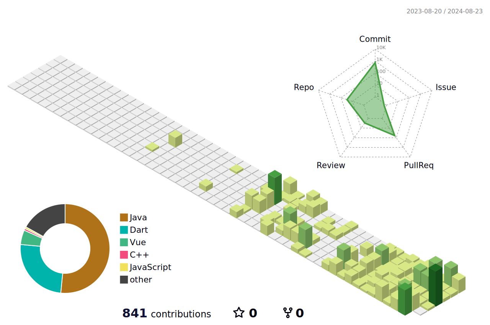

<h1> Hello, There!</h1>

<h1>JOO JIN SUNG 😉</h1>

I'm jinsung, <code>backend-end</code> developer from Korea. I use java often.

<h2>MY TECH STACK </h2>

   
   
   

  
  
  
  

   
<h2>🛠️ TOOLS 🛠️</h2>

   
  
  
  
  
  
  

  <h3>📱Contact</h3>
     
  

  <h3>🚀 Skills</h3>

    
  
   
   
    
 
    
  
   
    
    

